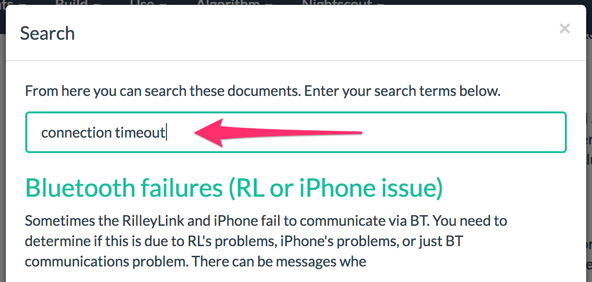

# Добро пожаловать в Loop!

## Введение

[Loop](https://github.com/LoopKit/Loop) - в переводе с англ. означает "петля". Это же название носит приложение для создания автоматизированной системы инъекций инсулина. Это камень, опирающийся на валуны работ, выполняемых многими другими.

Приложение построено поверх [LoopKit](https://github.com/LoopKit/LoopKit), набор фреймворков, обеспечивающих хранение, поиск и обработку данных, используемых в Loop.

!!!warning "Важно".

  Пожалуйста, поймите, что этот проект:

  - является в высшей степени экспериментальным
  - не одобрен в качестве терапевтического средства

   **Вы берёте на себя полную ответственность за создание и запуск такой системы, и делаете это на свой страх и риск.**

Используя opensource-приложение "Loop", вы cможете построить систему доставки инсулина, которая использует определённые коммерческие и открытые аппаратные и программные технологии, объединяя инсулиновую помпу, систему непрерывного мониторинга глюкозы (НМГ, либо CGM) и алгоритм дозирования инсулина для создания "петли" непрерывной дозировки базального инсулина. Эта петля прогнозирует будущую глюкозу, основываясь на расписании базальной скорости, потреблении углеводов, уже вколотом инсулине, и текущих показаниях НГМ. Эти прогнозы глюкозы дают Loop информацию, необходимою, чтобы выработать рекомендации по величене временной базальной скорости для достижения целевого диапазона глюкозы в будущем. Система может либо работать в режиме так называемого "открытого контура", давая рекомендации пользователю, который должен их утвердить для использовании в помпе, либо в режиме "закрытого контура", автоматически устанавливая рекомендуемую временную базальную скорость. 

Знакомство с проектом следует осуществлять поэтапно. Например, сначала "разомкните контур", чтобы ознакомиться с работой системы "Loop". Кроме того, изучите код, чтобы понять, что он рекомендует, и почему. Затем, когда вы перейдете к "замкнутому циклу", сделайте это безопасно, начав с установки соответствующих лимитов безопасности, и только после нескольких дней без минимумов перейдите к более высоким лимитам. Пожалуйста, задайте на этом этапе вопросы о том, как и почему Loop вычисляет свои рекомендации. Они должны быть похожи на терапевтические решения, которые вы бы сделали сами. Если рекомендации, которые дает Loop, отличаются от тех, которые вы бы дали сами себе, постарайтесь выяснить, почему.

## История развития

Loop была разработана как проект с открытым исходным кодом. Если Вам интересна история разработки Loop, прочтите заметку [History of Loop and LoopKit](https://medium.com/@loudnate/the-history-of-loop-and-loopkit-59b3caf13805), написанную разработчиком Loop Нейтом Раклиефтом. Проект продолжает оставаться любимым трудом сообщества пользователей; он поддерживается и совершенствуется волонтерами.

## Как использовать эту документацию

* Используйте навигационное меню в верхней части экрана, чтобы найти нужную вам информацию.
* Содержание текущей страницы всегда отображается в левой части экрана.
* Вы можете искать на сайте Loop Docs, нажав на иконку .

  .

## Оставайся в петле!

[Подпишитесь на список объявлений пользователей петли](https://groups.google.com/forum/#!forum/loop-ios-users), чтобы быть в курсе критических проблем, которые могут возникнуть.

Присоединяйтесь к Zulipchat по адресу [https://loop.zulipchat.com](https://loop.zulipchat.com).

Существует также [Looped Facebook Group](https://www.facebook.com/groups/TheLoopedGroup/?fref=nf), к которой вы, возможно, захотите присоединиться для получения поддержки. Когда вы запрашиваете присоединение к группе, не забудьте поставить галочку напротив вашего сообщения в Facebook и ответить на него.

## Внести свой вклад

Пожалуйста, подумайте, могли бы Вы внести вклад в это документацию. Это можно сделать, отправив запрос Pull Request в [loopdocs repo](https://github.com/LoopKit/loopdocs). Для получения дополнительной информации о том, как внести свой вклад в проект с открытым исходным кодом, может оказаться полезным данное руководство [How to Contribute to Open Source](https://opensource.guide/how-to-contribute/). Также, пожалуйста, ознакомьтесь с Петлей [LICENSE](https://github.com/LoopKit/Loop/blob/master/LICENSE.md) и Петлей [CODE_OF_CONDUCT](https://github.com/LoopKit/Loop/blob/master/CODE_OF_CONDUCT.md).

